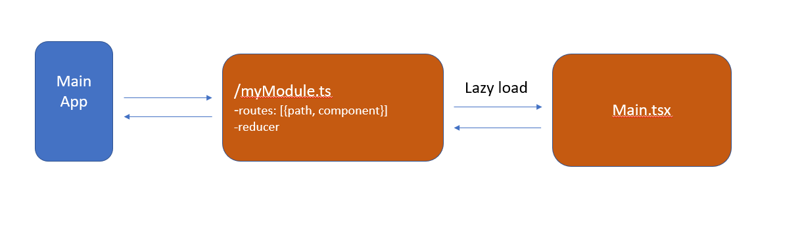

# Micro Frontend boostrap

### Description

This is basic structure for micro frontend app that contains single React instance for different module inside main application

### Structure
The structure of the application as follow:

 
 
App structure

Main app contains common information, layout. After render, it will load a module base on static url address.
Inside the module has a main entry which has list of routes, its components and root reducer of the module. All components are lazy loaded from the entry.
Module can access and update its own store and the store that are defined in common.

### How to run

1. `Yarn start` in root folder
2. `Yarn start` in `modules/`

For details setup explaination _(comming soon...)_
